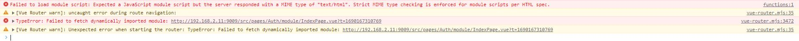
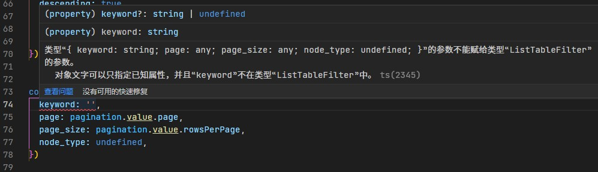

# Vue第一篇

## Vue2 父子组件响应式传值

应用场景是：

在父组件中传入一个值，在子组件中通过传入的值来控制是否显示弹窗。其实这里可以直接在子组件调用时添加一个`v-if`来控制显示与否。

### 解决的问题

1. 父组件向子组件传值时，通过接收的值控制显示与否。
2. 关闭弹窗时，子组件重新通知父组件，弹窗关闭了，设置控制显示的值为false。
3. 关闭弹窗时，通知父组件，刷新`el-select`下拉列表。

### 父组件关键代码

父组件

```html
<div>
  <el-form-item label="选择所属项目">
    <el-select
      ref="createGroupProject"
      v-model="project_identify_key"
      filterable
      remote
      reserve-keyword
      placeholder="请选择项目"
      :remote-method="projectRemoteMethod"
      :loading="project_loading"
      @change="projectSelect"
    >
      <el-option
        v-for="item in projectList"
        :key="item.identify_key"
        :label="item.name"
        :value="item.identify_key"
      />
      <el-option v-if="projectList.length==0" :disabled="true" value="" style="font-weight:500;font-size: 14px;padding: 0 20px;color: #606266;height: 34px;line-height: 34px;">还没有项目</el-option>
      <div style="border-top:1px solid #e4e7ed;text-align:center;display:block;">
        <el-button type="text" icon="el-icon-plus" @click="createGroupProject">创建项目</el-button>
      </div>
    </el-select>
  </el-form-item>

  <el-form-item label="选择所属分组">
    <el-select
      ref="createGroupSub"
      v-model="basicFormData.group_identify_key"
      filterable
      remote
      reserve-keyword
      placeholder="请选择分组"
      :disabled="project_identify_key ? false : true"
      :remote-method="groupRemoteMethod"
      :loading="group_loading"
    >
      <el-option
        v-for="item in groupList"
        :key="item.identify_key"
        :label="item.name"
        :value="item.identify_key"
      />
      <el-option v-if="groupList.length==0" :disabled="true" value="" style="font-weight:500;font-size: 14px;padding: 0 20px;color: #606266;height: 34px;line-height: 34px;">还没有分组</el-option>
      <div style="border-top:1px solid #e4e7ed;text-align:center;display:block;">
        <el-button type="text" icon="el-icon-plus" @click="createGroupSub">添加分组</el-button>
      </div>
    </el-select>
  </el-form-item>

  <BroadcastProjectGroup :show-dialog="createGroupDialog" @closeDialog="closeCreateGroupProject" />
  <BroadcastSubGroup :show-dialog="createGroupSubDialog" @closeDialog="closeCreateGroupSub" />
</div>
```

上述是html代码，其中

```html
<el-option v-if="projectList.length==0" :disabled="true" value="" style="font-weight:500;font-size: 14px;padding: 0 20px;color: #606266;height: 34px;line-height: 34px;">还没有项目</el-option>
<div style="border-top:1px solid #e4e7ed;text-align:center;display:block;">
  <el-button type="text" icon="el-icon-plus" @click="createGroupProject">创建项目</el-button>
</div>
```

一个是快捷添加列表项目按钮，上面还加了一个没有任何项目时的列表，否则不显示“创建项目”按钮的。

下面是父组件的JS代码：

```js
<script>
import BroadcastProjectGroup from '@/components/QuickAdd/BroadcastProjectGroup'
import BroadcastSubGroup from '@/components/QuickAdd/BroadcastSubGroup'
export default {
  components: {
    BroadcastProjectGroup,
    BroadcastSubGroup
  },

  methods: {
    // 打开弹窗 创建项目
    createGroupProject() {
      this.createGroupDialog = true
      this.$refs.createGroupProject.blur()
      console.log(this.createGroupDialog)
    },
    // 打开弹窗 创建分组
    createGroupSub() {
      this.createGroupSubDialog.show = true
      this.createGroupSubDialog.parent_key = this.project_identify_key
      this.$refs.createGroupSub.blur()
    },
    // 在子组件关闭弹窗时触发
    closeCreateGroupProject(val) {
      this.createGroupDialog = val
      // 添加完成 弹窗关闭 刷新下拉列表
      console.log(val)
      this.getProjectList()
    },
    // 在子组件关闭弹窗时触发
    closeCreateGroupSub(val) {
      // 添加完成 弹窗关闭 刷新下拉列表
      if (val) {
        this.projectSelect(val)
      }
      this.createGroupSubDialog.show = val
    }
  }
}
```

### 子组件关键代码

子组件一

```html
<template>
  <div class="groupingDialog">

    <el-dialog
      :close-on-click-modal="false"
      :title="newProjectFormData.id ? '编辑项目':'创建项目'"
      :visible.sync="newProjectdialog"
      width="40%"
      @close="newProjectCancel"
    >
      <el-form :model="newProjectFormData">
        <el-form-item
          label="项目名称"
          label-width="120px"
        >
          <el-input
            v-model="newProjectFormData.name"
            autocomplete="off"
          />
        </el-form-item>
        <el-form-item
          label="项目地址"
          label-width="120px"
        >
          <Map
            :ext="newProjectFormData.ext"
            @getLocation="getLocationPoint"
          />
        </el-form-item>
      </el-form>
      <div
        slot="footer"
        class="dialog-footer"
      >
        <el-button @click="newProjectCancel">取 消</el-button>
        <el-button
          type="primary"
          @click="newProjectOK"
        >确 定</el-button>
      </div>
    </el-dialog>

  </div>
</template>

<script>
import { addProjectGrouping, batchBindingEquipment, batchUnbindEquipment, delProjectGroupingByKey, exitProjectGroupingByKey, getArea, getProjectGroupingByKey, getProjectGroupingList } from '@/api/projectGrouping'
import Map from '@/components/Map'
import { mapGetters } from 'vuex'
export default {
  components: {
    Map
  },
  props: {
    showDialog: {
      type: Boolean,
      default: false
    }
  },
  computed: {
    ...mapGetters([
      'configOptions'
    ]),
    newProjectdialog: {
      get() {
        return this.showDialog
      },
      set(newValue) {
        this.$emit('closeDialog', newValue)
      }
    }
  },
  data() {
    return {
      newProjectFormData: {
        name: '',
        geo: '',
        ext: { address: '' }
      } // 创建项目时的数据存储位置 - 暂时
      // newProjectdialog: false
    }
  },

  watch: {

  },
  mounted() {
    console.log(this.showDialog)
    // this.getSDCardListsData()
  },
  methods: {
    // 创建项目弹窗 - 确认
    async newProjectOK() {
      if (this.newProjectFormData.id) {
        // 编辑
        await exitProjectGroupingByKey(this.newProjectFormData.id, this.newProjectFormData)
        this.$message.success('修改成功')
      } else {
        // 新增
        await addProjectGrouping(this.newProjectFormData)
        this.$message.success('创建成功')
      }

      // 重新修改父组件传入的值
      this.newProjectdialog = false
      // 通过 this.$emit( )刷新了父组件
      // this.getProjectGroupingListData()
    },
    // 创建项目弹窗 - 取消
    newProjectCancel() {
      ...

      // 重新修改父组件传入的值
      this.newProjectdialog = false
    }

  }
}
</script>

<style lang="scss" scoped>
</style>

```

子组件二

子组件二，接收的数据是一个对象，不是一个值，对象应该是引用传递。

```html
<template>
  <div class="groupingDialog">
    <el-dialog
      :close-on-click-modal="false"
      :title="groupingFormData.id ? '编辑分组':'创建分组'"
      :visible.sync="groupingdialog.show"
      width="40%"
      top="3vh"
      @close="groupingCancel"
    >
      <el-form
        ref="groupingFormData"
        :model="groupingFormData"
        :rules="rules"
      >
        <el-form-item
          label="分组名称"
          prop="name"
          label-width="120px"
        >
          <el-input
            v-model="groupingFormData.name"
            autocomplete="off"
          />
        </el-form-item>
        <el-form-item
          label="上级项目"
          label-width="120px"
        >
          <el-select
            v-model="groupingdialog.parent_key"
            placeholder="请选择"
            @change="selectChange"
          >
            <el-option
              v-for="item in groupingProjectOptions"
              :key="item.value.id"
              :label="item.label"
              :value="item.value.identify_key"
            />
          </el-select>
        </el-form-item>

      </el-form>
      <div
        slot="footer"
        class="dialog-footer"
      >
        <el-button @click="groupingCancel">取 消</el-button>
        <el-button
          type="primary"
          @click="groupingOK"
        >保 存</el-button>
      </div>
    </el-dialog>
  </div>
</template>

<script>
import { addProjectGrouping, batchBindingEquipment, batchUnbindEquipment, delProjectGroupingByKey, exitProjectGroupingByKey, getArea, getProjectGroupingByKey, getProjectGroupingList } from '@/api/projectGrouping'
import { equipmentList } from '@/api/equipment'
import { mapGetters } from 'vuex'
import XYString from '@/components/XYString'
import Map from '@/components/Map'
export default {
  components: {
    XYString,
    Map
  },
  props: ['showDialog'],

  computed: {
    ...mapGetters([
      'configOptions'
    ])
  },
  data() {
    
    return {
      groupingdialog: this.showDialog,
      
      groupingFormData: {
        name: '',
        id: '',
        parent_key: '',
        weight: 1,
        remark: '',
        plane_map: '',
        province: '', // 省
        city: '', // 市
        area: '', // 区
        geo: '', // 经纬度
        address: '' // 地址
      }, // 创建分组弹窗 - 数据存放
      // groupingdialog: false,

      projectData: [], // 项目列表数据
      groupingProjectOptions: [], // 新增分组弹窗 - 项目下拉数据
      groupingProjectValue: '',

      provinceOptions: [],
      cityOptions: [],
      areaOptions: [],
      fileList: [],
      ImgUrl: '',
      dialogVisible: false
    }
  },
  mounted() {
    this.getProjectGroupingListData()
  },
  methods: {
    // 获取项目列表数据
    async getProjectGroupingListData(name) {
      const res = await getProjectGroupingList({
        parent_key: '0',
        page: this.page,
        per_page: this.pageSize,
        name
      })
      // console.log(res);
      const { data, total } = res.data.data
      this.projectData = data

      this.total = total
      if (data) {
        this.addGrouping()
      }
    },

    // 添加分组
    async addGrouping() {
      const arr = []

      this.projectData.map(item => {
        arr.push({ label: item.name, value: item })
        this.groupingProjectOptions = arr
      })

      const res = await getArea()
      const { data } = res.data
      if (data && data.length > 0) {
        this.provinceOptions = data
      }
    },

    // 添加、编辑 分组弹窗 - 保存
    async groupingOK() {
      if (this.groupingFormData.parent_key == '') {
        this.groupingFormData.parent_key = this.groupingdialog.parent_key
      }

      // return
      try {
        ...

        // 刷新父组件的分组下拉列表
        console.log(555, this.groupingFormData.parent_key)
        this.$emit('closeDialog', this.groupingFormData.parent_key)
  
         // 刷新父组件传入的值
        this.groupingdialog.show = false
      } catch (err) {
        console.log(err)
      }
    },
    // 添加分组弹窗 - 取消
    groupingCancel() {
      ...

      this.groupingdialog.show = false
      this.groupingProjectValue = ''
    },

    // 获取分组数据列表
    async getGroupingListData(parent_key, name) {
      const res = await getProjectGroupingList({
        parent_key: parent_key,
        page: this.grouping_page,
        per_page: this.grouping_pageSize,
        name
      })
      const { data, total } = res.data.data
      this.groupingData = data
      this.grouping_total = total
    },
    // 分组弹窗 - 选择分组弹窗项目下拉时的数据变化
    selectChange(value) {
      console.log(888, value)
      this.groupingFormData.parent_key = value
    },

  }
}
</script>

<style lang="scss" scoped>

</style>

```

### 参考文档

[vue 中 computed属性中的get与set； - Harryrui - 博客园](https://www.cnblogs.com/harryzong/p/17171982.html)

[Vue2 props引用传递和值传递响应式变化 - 脉望 - 博客园](https://www.cnblogs.com/simdot/p/14843213.html)

也可以通过组件上的v-model指令以及.sync修饰符，实现双向绑定

[Vue组件Prop的双向绑定（v-model,.sync） - 京鸿一瞥 - 博客园](https://www.cnblogs.com/caijinghong/p/14270540.html)

[子组件“双向绑定”父组件传进来的props - 掘金](https://juejin.cn/post/7082389514353639438)

向`el-select`组件中添加自定义按钮，但是很遗憾element-ui没有给我们提供这个插槽。

不用这种方式，我实现了。

[element-ui下拉框添加添加数据按钮（自用）_elementui下拉按钮_小白的蓝色生活的博客-CSDN博客](https://blog.csdn.net/chj_2020/article/details/113343213)

### Vue2 props引用传递怎么理解？

在 Vue2 中，如果您将一个对象或数组作为 props 传递给子组件，它将以引用传递的方式传递。这意味着子组件中对这个对象或数组的更改将影响到父组件中的原始数据。

让我们通过一个例子来理解这个概念。假设我们有一个父组件和一个子组件，父组件通过 props 向子组件传递了一个数组：

```html
<!-- 父组件 -->
<template>
  <div>
    <child-component :items="items"></child-component>
  </div>
</template>

<script>
export default {
  data() {
    return {
      items: ['item1', 'item2', 'item3']
    }
  }
}
</script>

<!-- 子组件 -->
<template>
  <div>
    <ul>
      <li v-for="item in items" :key="item">{{ item }}</li>
    </ul>
    <button @click="addItem">Add Item</button>
  </div>
</template>

<script>
export default {
  props: ['items'],
  methods: {
    addItem() {
      this.items.push('new item');
    }
  }
}
</script>
```

### 遇到问题

el-dialog中@close事件和取消确认按钮并用，会触发两次关闭表单的操作
Vue  el-dialog  Prop  双向绑定 v-model   .sync

1. [关于el-dialog中@close事件和取消确认按钮并用，会触发两次关闭表单的操作（！表单为子组件时）_dialog 关闭按钮事件_RonnieFeng的博客-CSDN博客](https://blog.csdn.net/csdn6107/article/details/126946319)
2. [el-dialog二次封装@close和取消按钮的@click调用两次 - 掘金](https://juejin.cn/post/7205390655857573943)
3. [el-dialog 的关闭事件执行两次_el-dialog close_IS_LeQian的博客-CSDN博客](https://blog.csdn.net/IS_huang/article/details/111632910)
4. [vue弹窗： el-dialog visible.sync触发父组件的update事件_dialogvisible_一木难求的博客-CSDN博客](https://blog.csdn.net/longwind8/article/details/119942686)
5. [v-model和.sync修饰符的区别(面试重点) - 掘金](https://juejin.cn/post/7021130949312118792)
6. [vue 双向绑定(v-model 双向绑定、.sync 双向绑定、.sync 传对象) - 再见列宁 - 博客园](https://www.cnblogs.com/lqpgjv/p/15245902.html)
7. [二次封装el-dialog组件，自定义组件应用v-model的实践_el-dialog v-model_code_源源的博客-CSDN博客](https://blog.csdn.net/qq_41885295/article/details/122063648)


## vue template v-for 中间添加计算

- vue template v-for 中间添加计算

由于有多层 `v-for`循环，想通过一个函数计算判断是否显示：`showItemLength(item3)>0`

```html
<div class="sensorList">
    <div>传感器数据</div>
    <div v-for="(item,index) in sensorData" :key="'aaa'+index" class="sensors_data">
      <template v-for="(item2,index2) in item">
        <div :key="'bbb'+index2">
          <div class="sensor_title">{{ item2.sensor_name }}</div>
          <template v-for="(item3,index3) in item2.data">
            <div v-if="index3 != '-' && index3 != '' && showItemLength(item3)>0" class="group_title">{{ index3 }}</div>
            <div class="data">
              <template v-for="(item4,index4) in item3">
                <template v-if="item4.show_data == 1">
                  <div
                    v-if="!isArray(item4.value)"
                    :key="'ccc'+index4"
                    class="card"
                    @click="echartShow(item4,index4)"
                  >
                    <span :class="{'move_overflowToDot':item4.value.length >= 14}">{{ item4.value }}({{
                      item4.unit_name ? item4.unit_name : '--' }})</span>
                    <span :class="{'move_overflowToDot':item4.function_name.length >= 20}">{{
                      item4.function_name }}</span>
                  </div>
                  <div
                    v-for="(valueItem,valueIndex) in item4.value"
                    v-else
                    :key="valueItem.name+valueIndex"
                    class="card"
                  >
                    <span :class="{'move_overflowToDot':valueItem.value.length >= 14}">{{
                      valueItem.value }}({{ valueItem.unit_name ? valueItem.unit_name : '--' }})</span>
                    <span :class="{'move_overflowToDot':valueItem.name.length >= 20}">{{ valueItem.name
                    }}</span>
                  </div>
                </template>
              </template>
            </div>
          </template>
        </div>
      </template>
    </div>
    <div v-if="!sensorData || sensorData.length == 0" class="img">
      
      <p>暂无数据</p>
    </div>
  </div>
  <script>
export default {
  props: ['items'],
  methods: {
    // 处理 - 判断是否显示传感器分类标题
    showItemLength(item3) {
      const result = (item3 || []).filter(function(x) {
        return x.show_data === 1
      })
      return result.length
    },
  }
}
</script>
```

### 参考文档

1. [vue常用指令，v-for渲染限制时显示条数；判断显示哪个元素；判断显示样式_v for限制显示个数_qq_39704803的博客-CSDN博客](https://blog.csdn.net/qq_39704803/article/details/88532901)


## Quasar 报错 Failed to fetch dynamically imported module



```
Failed to load module script: Expected a JavaScript module script but the server responded with a MIME type of "text/html". Strict MIME type checking is enforced for module scripts per HTML spec.

vue-router.mjs:35 [Vue Router warn]: uncaught error during route navigation:
warn @ vue-router.mjs:35
triggerError @ vue-router.mjs:3470
（匿名） @ vue-router.mjs:3186
Promise.catch（异步）
pushWithRedirect @ vue-router.mjs:3180
push @ vue-router.mjs:3112
...

vue-router.mjs:3472 TypeError: Failed to fetch dynamically imported module: http://192.168.2.11:9009/src/pages/Auth/module/IndexPage.vue?t=1690167310769

triggerError @ vue-router.mjs:3472
（匿名） @ vue-router.mjs:3186
Promise.catch（异步）
pushWithRedirect @ vue-router.mjs:3180
push @ vue-router.mjs:3112

...

vue-router.mjs:35 [Vue Router warn]: Unexpected error when starting the router: TypeError: Failed to fetch dynamically imported module: http://192.168.2.11:9009/src/pages/Auth/module/IndexPage.vue?t=1690167310769
```

原因：

```js
{
  label: '操作',
  align: 'right',
  field: (row: AuthModule) => row,
  format: (val: AuthModule) => {
    return [
    h(QBtn, {
        dense: true,
        square: true,
        class: 'q-px-sm',
        flat: true,
        unelevated: true,
        color: 'primary',
        label: '编辑',
        onClick: () => {
          $q.dialog({
            component: FormDialog, // 这里模块的原因
            componentProps: {
              title: '编辑模块',
              formData: val,
            }
          }).onOk(() => {
            fetchDataList()
          })
        }
      })


    ]
  }
}
```

## VuePress 报错

```
node:internal/crypto/hash:71
  this[kHandle] = new _Hash(algorithm, xofLen);
                  ^

Error: error:0308010C:digital envelope routines::unsupported
```

原因Node版本的问题，因为我在本地开发环境中使用nvm多版本，需要切换到node16.20.0

```
PS D:\Hostv\icmsite> nvm ls

  * 18.16.0 (Currently using 64-bit executable)
    16.20.0
    14.19.1
PS D:\Hostv\icmsite> nvm use 16.20.0
Now using node v16.20.0 (64-bit)
PS D:\Hostv\icmsite> npm run dev

> newinit@1.0.0 dev
> vuepress dev .

wait Extracting site metadata...
tip Apply theme @vuepress/theme-default ...
tip Apply plugin container (i.e. "vuepress-plugin-container") ...
tip Apply plugin @vuepress/last-updated (i.e. "@vuepress/plugin-last-updated") ...
tip Apply plugin @vuepress/register-components (i.e. "@vuepress/plugin-register-components") ...
tip Apply plugin @vuepress/active-header-links (i.e. "@vuepress/plugin-active-header-links") ...
success [11:33:55] Build d5a4d5 finished in 20015 ms!
> VuePress dev server listening at http://localhost:8081/
```

## TypeScript编译器提示报错 对象文字可以只指定已知属性ts(2345)



```js
import { ref } from 'vue';

export type TTableFilter = {
  keyword?: string;
  page?: number;
  page_size?: number;
};

interface ListTableFilter extends TTableFilter {
  node_type?: number;
}

// 使用ref函数，并通过类型断言指定类型
const filter = ref<ListTableFilter>({
  keyword: '',
  page: pagination.value.page,
  page_size: pagination.value.rowsPerPage,
  node_type: undefined,
} as ListTableFilter);

// 现在filter是一个ref对象，并且其值具有ListTableFilter类型
// 您可以在模板中使用filter.value来访问其值
```

ChatGPT解释：在您的代码中，keyword属性在ListTableFilter中是可选的，因此它可能存在或者不存在。

能出现这个错误的原因是，ListTableFilter类型中的keyword属性是可选的，但在创建filter对象时，您明确指定了keyword: ''，这意味着keyword属性必须存在并且是一个字符串。由于keyword属性是可选的，TypeScript认为这个属性不在ListTableFilter类型中，从而报错。

为了解决这个问题，您可以使用"类型断言"`as ListTableFilter`来明确告诉TypeScript filter对象的类型。请尝试以下代码：

```js
// 使用ref函数，并通过类型断言指定类型
const filter = ref<ListTableFilter>({
  keyword: '',
  page: pagination.value.page,
  page_size: pagination.value.rowsPerPage,
  node_type: undefined,
} as ListTableFilter);
```

这是因为传入的keyword有可能是为undefined的，但是我们给的keyword默认值，这和直接指定keyword为空字符想冲突的。

这个时候可以使用类型断言。

### 参考文档

- 类型断言 as、TypeScript的函数类型
- vue3  ref   as 类型断言
- vue3 指定ref类型
- TypeScript 可选的类型属性    类型断言

1. [Vue3+TS Day28 - 类型断言 as、TypeScript的函数类型 - 简书](https://www.jianshu.com/p/cc229fc9f388)
2. [vue3+ts 中 ref与reactive 如何指定类型 - 简书](https://www.jianshu.com/p/08887a101755)